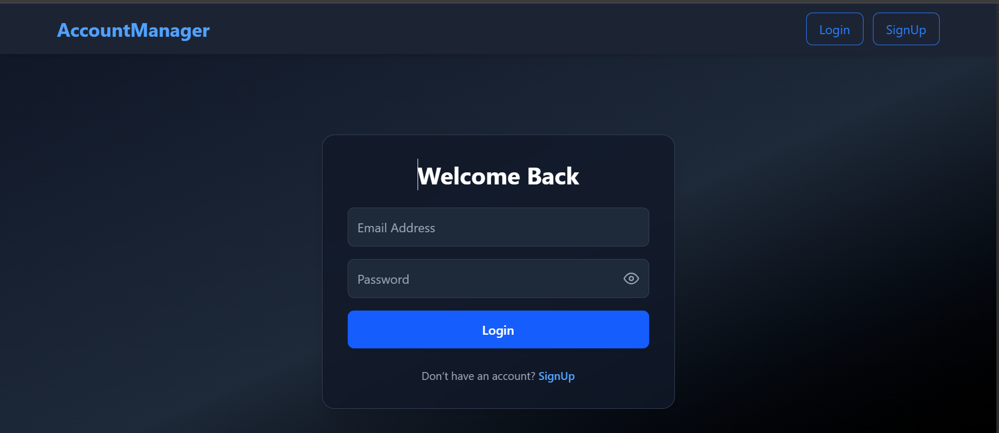
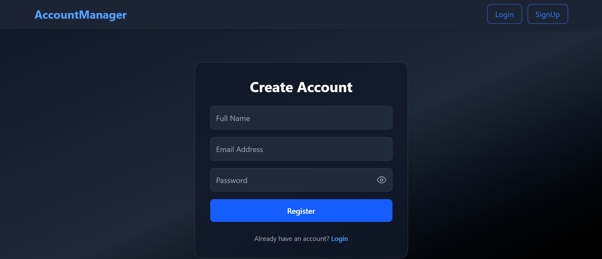
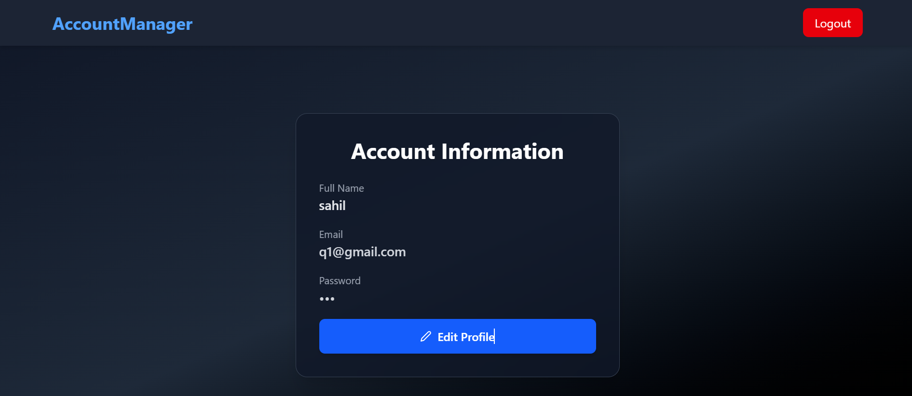
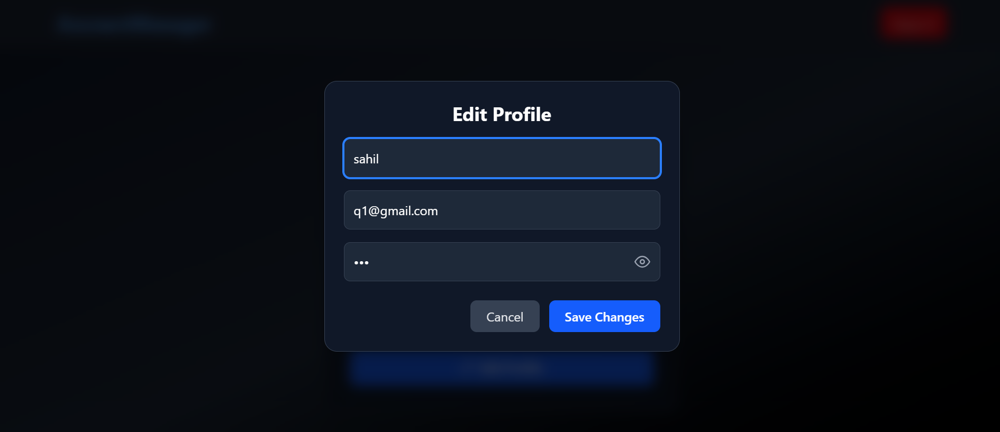

# Account Management App (React v16+)

A simple and responsive **React application** that allows users to **create, log in, view, and manage their account details** with a clean, dark-themed UI.

---

## 🌐 Live Demo & Portfolio

🔹 **Live App:** [https://useraccountmanagement.netlify.app/](https://useraccountmanagement.netlify.app/)  
🔹 **My Portfolio:** [https://sahilbaraiya.netlify.app/](https://sahilbaraiya.netlify.app/)


---

## 📸 Screenshots

###  Login Page


###  Signup Page


### 👤 Account Page


###  Edit Profile Modal


##  Features

- **User Registration:** Create a new account with name, email and password.  
- **Login System:** Secure login with password visibility toggle.  
- **Account Management:** View and edit account details such as name and password.  
- **Real-time UI Updates:** Instantly reflects profile changes without page reload.  
- **Toast Notifications:** Integrated with React Toastify for smooth user feedback.  
- **Dark Theme UI:** Clean and modern design with responsive layout for all devices.

---

## 🛠️ Tech Stack

- **Frontend:** React (v16+), Tailwind CSS  
- **State Management:** React Hooks (`useState`, `useEffect`)  
- **Notifications:** React Toastify  
- **Icons:** React Icons  
- **Styling:** Responsive design with Tailwind CSS  

---


---

## ⚙️ Installation & Setup


To run the application locally, follow these steps:

1. **Clone the Repository**
   ```bash
   git clone https://github.com/sahilbaraiya/user-management.git

   cd user-management

2. **Install the dependencies**:
   ```bash
   npm install

3. **Start the development server**:
   ```bash
    npm run dev

4. **Open the application**:
    ```bash
    The application will open in your default browser.


